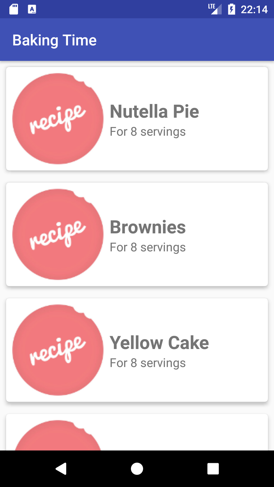
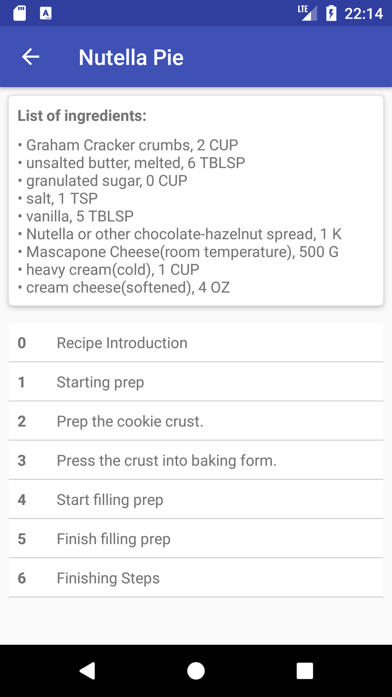
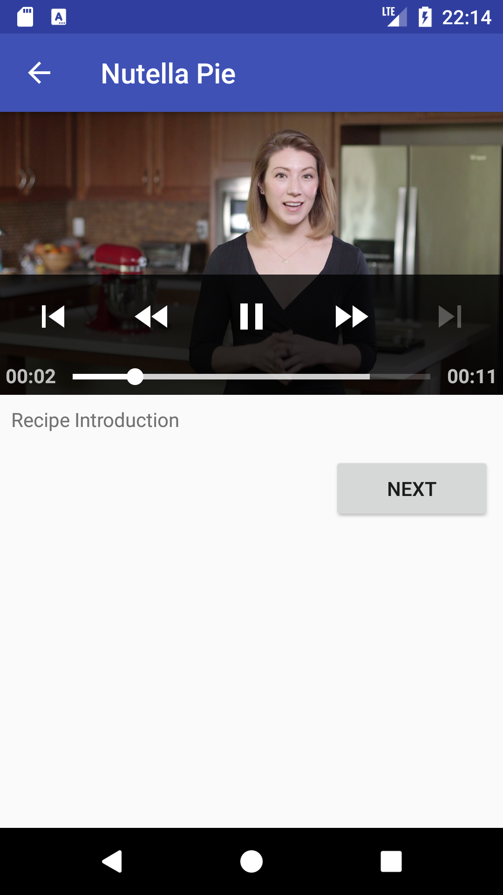
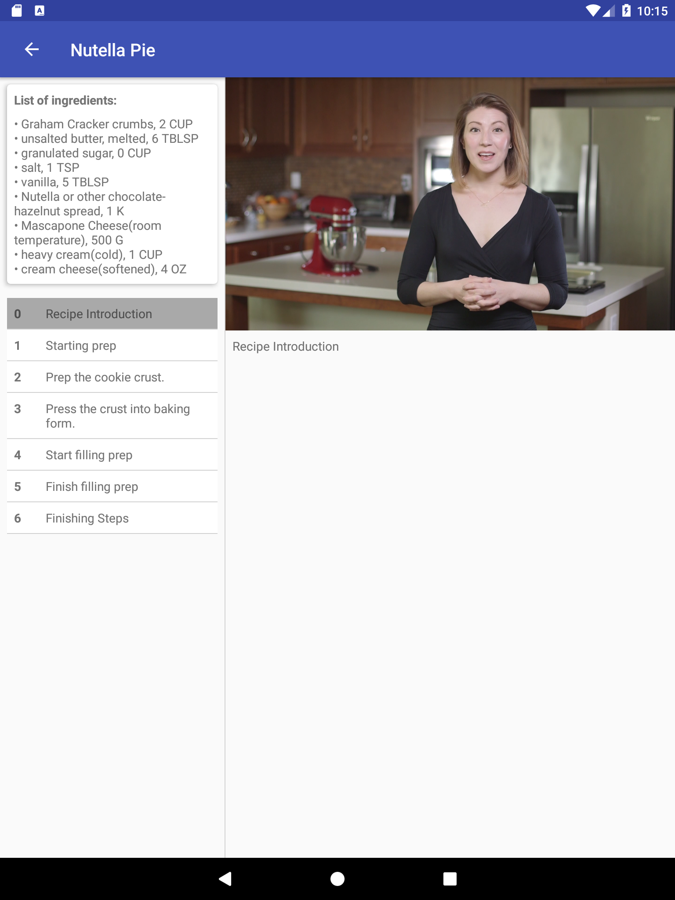

# Baking Time App
## Project overview
Building this app was part of the [Android Developer Nanodegree](https://eu.udacity.com/course/android-developer-nanodegree-by-google--nd801) by Udacity. The tasks for this app where:

* Use MediaPlayer/Exoplayer to display videos.
* Handle error cases in Android.
* Add a widget to your app experience.
* Leverage a third-party library in your app.
* Use Fragments to create a responsive design that works on phones and tablets.

Some impression of the final project state:

## Software, libraries, and services

Build with:
* Android Studio 3.1
* JRE 1.8.0
* [Picasso](http://square.github.io/picasso/) (Loading images from the web)
* [Butterknife](http://jakewharton.github.io/butterknife/) (Simplified view binding)
* [Exoplayer](https://github.com/google/ExoPlayer) (Load and play videos from the web)
